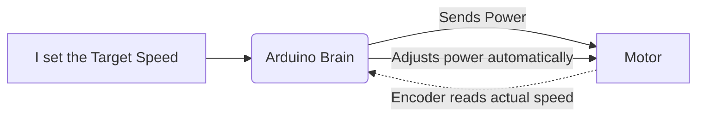
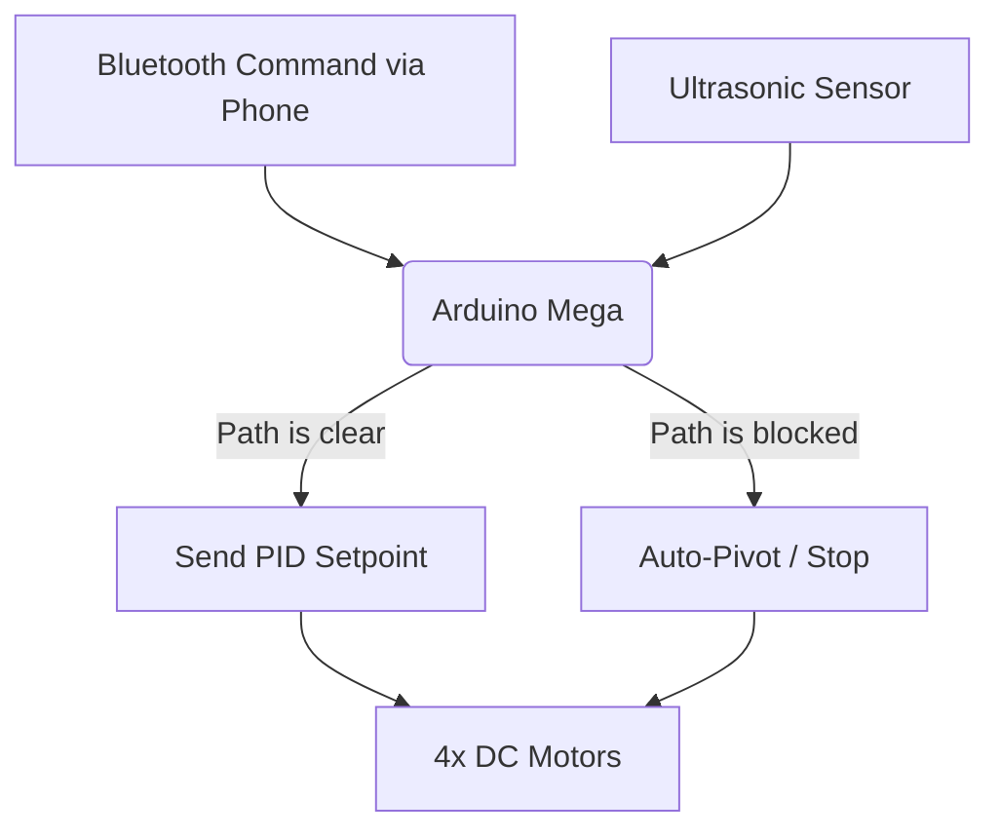

# Bluetooth-Controlled-4WD-Robot-with-PID-Speed-Regulation-and-Ultrasonic-Obstacle-Avoidance
A physical 4-wheel-drive robotic car that uses PID controllers to drive perfectly straight, controllable via Bluetooth with built-in ultrasonic obstacle avoidance. #arduino #robotics #pidController #rover #obstacleAvoidance

# Building an Autonomous 4WD Rover: From Tinkercad to Real Life!

Hey there! Welcome to my 4WD Rover project.

This repository documents my journey of building a smart robotic car from scratch. Instead of just jumping straight into the hardware, I wanted to really understand the math and physics behind motor control. So, I split this project into three distinct phases: starting with a basic simulation, writing a custom PID controller to make it "smart," and finally building the real, physical 4-wheel-drive rover.

Here is a breakdown of how the project evolved (and where to find the code for each step).

---

## What is inside this repo?

I have organized the project into three folders so you can follow along with my process:

* **Phase_1_Open_Loop/**: The basic Tinkercad simulation code and wiring diagrams.
* **Phase_2_Closed_Loop/**: The advanced Tinkercad simulation where I built a custom PID controller.
* **Phase_3_Hardware_4WD/**: The final C++ code for the physical Arduino Mega rover, plus photos of the build.

---

## Phase 1: The Basics (Open-Loop Simulation)

*Check out the Phase_1_Open_Loop folder for this code.*

Before building anything physical, I booted up Tinkercad to figure out how to control motor speed. In this first phase, I used a standard potentiometer (a twisty knob) to send a PWM signal to an Arduino Uno, which talked to an L293D motor driver.

I also hooked up an encoder to read the actual RPM of the motor. 

**The catch:** This is an "open-loop" system. If the motor suddenly goes up a hill (simulated load), it slows down. The Arduino does not care, it just keeps sending the same power level. I needed to fix that.

---

## Phase 2: Adding Brains (Closed-Loop PID Simulation)

*Check out the Phase_2_Closed_Loop folder for this code.*

To fix the issue from Phase 1, I needed the system to monitor itself. I replaced the twisty knob with two pushbuttons to set a "Target Speed."

Then, I wrote a custom PID (Proportional-Integral-Derivative) algorithm from scratch. Now, the Arduino constantly checks the encoder to see how fast the motor is actually spinning, compares it to my Target Speed, and calculates the exact amount of power needed to fix the difference. If the motor hits a snag, the Arduino automatically hits the gas to keep the speed steady!

---

## Phase 3: The Real Deal (Physical 4WD Hardware)

*Check out the Phase_3_Hardware_4WD folder for this code.*

Simulations are great, but hardware is where the fun is. I took the math from Phase 2 and scaled it up to a physical 4-Wheel-Drive chassis powered by an Arduino Mega.

Because real-world physics are messy, I used four individual encoders (one for each wheel). If one wheel gets stuck on a rock, its specific PID loop gives it more juice so the car still drives perfectly straight.

**I also added two major upgrades:**

1. **Bluetooth Remote Control (HC-05):** I can drive the car manually using my phone.
2. **Autonomous Safety Gate (HC-SR04):** I strapped an ultrasonic eye to the front. If I try to manually drive the car into a wall, the sensor detects it, overrides my command, and stops the car. If I put it in "Auto Mode", it will drive itself and actively dodge obstacles!

### How the Hardware Logic Works:

---

## Parts List (If you want to build the physical rover)

If you want to recreate the final hardware build, here is what I used:

* **1x** Arduino Mega 2560 (You need the extra interrupt pins for 4 encoders)
* **4x** DC Motors with built-in quadrature encoders
* **2x** L298N Motor Drivers
* **1x** HC-SR04 Ultrasonic Sensor
* **1x** HC-05 Bluetooth Module
* Acrylic 4WD chassis and Lithium-Ion battery pack

---

## How to use the code

If you are running the Phase 3 hardware code, you will need to grab two awesome libraries via the Arduino IDE Library Manager:

* `Encoder` by Paul Stoffregen
* `PID` by Brett Beauregard

To drive the car, connect to the HC-05 via any Bluetooth Serial app and send these keys:

* `F` / `f`: Forward (Fast/Slow)
* `B` / `b`: Backward (Fast/Slow)
* `L` / `R`: Tank Turn Left/Right
* `S`: Stop everything
* `A`: Activate Autonomous Avoidance Mode

*Thanks for checking out my project! Feel free to explore the code and use any of it for your own robotics builds.*
